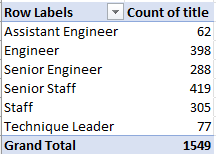

# **Preparing for the upcoming "silver tsunami"**

## Overview of the analysis: 
    This analysis will assist in determining the number of retiring employees 
    per title and identify employees who are eligible to participate in a mentorship program. 

## Results: 
    The analysis shows that there are: 
        1. There are a total of 7 titles with 72,458 employees that are possibly retiring. 

        2. There are a total of 1,549 current employees that are born in year 1965 that are eligible 
        to participate in a mentorship program. The table below shows how many employees holding 
        different job titles are eligible for mentorship.

        3. Comparing the two tables, there are more upcoming retirees than employees eligible for 
        mentorship using the provided criteria. 

        4. The criteria for determing employees eligible to participate in mentorship is only looking 
        at an age group versus an employee who has a long list of experiences or time at the company 
        that could be valuable in transitioning into different roles or backfill some of vacant roles once the retirees 
        exit the work force. 

## Summary: 
    Overall the company would require to begin fullfilling 72, 458 roles as the "silver tsunami" begins. With the criteria
     provided for mentorship elgibity there are not enough employees to fulfill these roles. Recommendations would be to open 
     the criteria for mentorship eligibility and to determine which departments these roles are going to be vacant due to the 
     upcoming "silver tsunami". Determining the departments will assist in providing better insight for mentorships and 
     fulfilling the upcoming vacant roles. 

    Updated the two queries to include department name for those that are coming to retirement age and 
    updated the mentorship eligiblity to current employees who are not of retirement age. The first query 
    to include department name will provide better insight to which department will have the largest impact 
    and prepare for that change. 

    
    The next query is to broaden the mentorship eligibility. The query reported back a larger group of employees eligible for 
    mentorship by lookin at their status and are outside of the retirment age. It should be available to 
    all employees who wishes to continue to grow within the company. Not only that but it will assist the company 
    with retaining their employees long term. 

